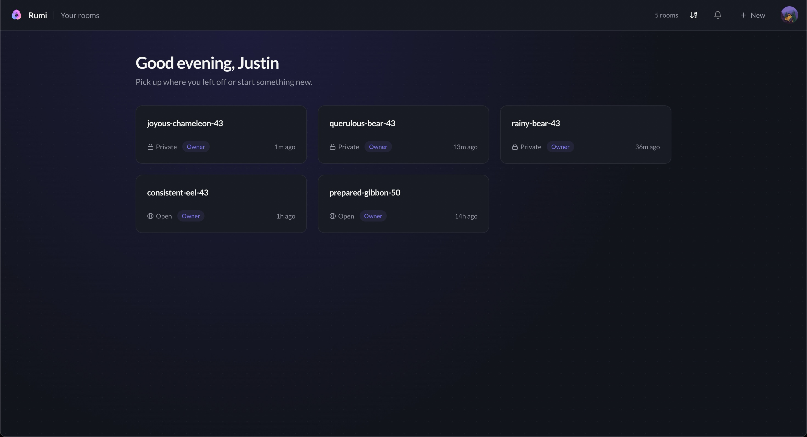
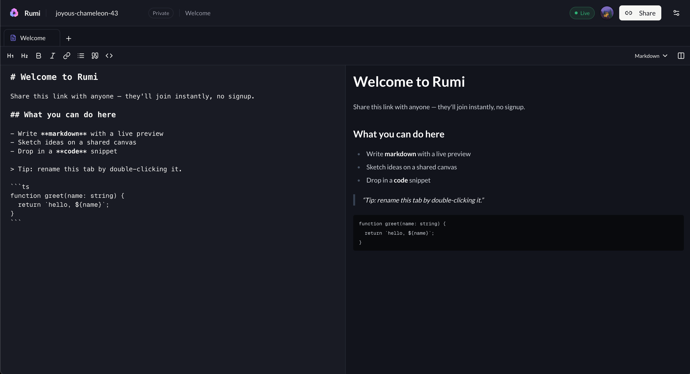

# Rumi

A real-time collaborative workspace built for developers. Create a room, share the link, and write code, markdown, and diagrams together — live.





---

## What you can do

**Write together in real time.**
Every keystroke is synced instantly. No refresh, no merge conflicts — just you and your collaborators in the same document.

**Tabs for every type of work.**
Each room supports multiple tabs. Pick the right surface for the job:

- **Markdown** — write docs, notes, or specs with a live rendered preview side by side. Full toolbar for formatting, syntax-highlighted code blocks.
- **Code** — a shared code editor with syntax highlighting across 150+ languages. Switch languages on the fly.
- **Drawing** — a collaborative infinite canvas powered by tldraw. Sketch diagrams, wireframes, or whatever you need. Grid and background settings sync across all users.

**Flexible access control.**
Two room types, full control over who can see and edit:

| | Open | Private |
|---|---|---|
| Who can join | Anyone with the link | Whitelisted emails only |
| Managing access | — | Add/remove emails via whitelist and blacklist |
| Guests (no account) | Sign-in required by default | Sign-in required by default |
| Guest override | Allow guests to view or edit | Allow guests to view or edit |

**Three-tier roles.**
- **Owner** — full control: rename, delete, transfer ownership, manage roles, manage whitelist/blacklist, change visibility
- **Admin** — create/delete/reorder tabs, kick members, manage whitelist/blacklist
- **Member** — edit tab content only

**Live presence.**
See who's in the room with you via overlapping avatars in the top bar. Every user gets a unique color.

**Notifications.**
Bell icon shows when someone grants you access to a room or accepts your invitation. Email notifications via Resend with one-click unsubscribe.

**Billing and plans.**
Three plans with yearly discounts:

| | Free | Pro | Max |
|---|---|---|---|
| Price | $0 | $8/mo ($6/mo billed yearly) | $20/mo ($15/mo billed yearly) |
| Rooms | 3 | 25 | 100 |
| Tabs per room | 3 | 10 | 50 |
| Concurrent users | 5 | 15 | 50 |
| File uploads | — | 20 MB | 50 MB |

Upgrade, switch plans, or cancel from Settings. Stripe handles checkout and billing.

**Dark mode default, fully themeable.**
Light, dark, or system. Swap your editor font, adjust font size, toggle word wrap and compact mode — all per-device, no account required.

---

## Tech stack

| | |
|---|---|
| Frontend | React + Vite + TanStack Router |
| Backend | Bun + Fastify |
| Real-time sync | Hocuspocus + Yjs (CRDTs) |
| Auth | Supabase (GitHub + Google OAuth) |
| Database | Postgres via Supabase + Drizzle ORM |
| Billing | Stripe (embedded Checkout + webhooks) |
| Email | Resend (transactional, RFC 8058 unsubscribe) |
| Editor | CodeMirror 6 |
| Drawing | tldraw v4 |
| Styling | Tailwind v4 |

---

## Getting started

### Prerequisites

- [Bun](https://bun.sh) >= 1.0
- A [Supabase](https://supabase.com) project (free tier works)
- Node.js >= 18 (for some tooling)

### 1. Clone and install

```bash
git clone https://github.com/your-org/rumi.git
cd rumi
bun install
```

### 2. Set up environment variables

**Server** (`apps/server/.env`):

```env
DATABASE_URL=your_supabase_connection_string
SUPABASE_JWKS_URL=https://your-project.supabase.co/auth/v1/.well-known/jwks
SUPABASE_JWT_ISSUER=https://your-project.supabase.co/auth/v1
WEB_URL=http://localhost:5173
```

Optional (billing): see [`docs/STRIPE_SETUP.md`](docs/STRIPE_SETUP.md) for Stripe configuration.
Optional (email): set `RESEND_API_KEY` for email notifications. Without it, emails are logged to stdout.

**Web** (`apps/web/.env`):

```env
VITE_API_URL=http://localhost:3000
VITE_SUPABASE_URL=https://your-project.supabase.co
VITE_SUPABASE_PUBLISHABLE_KEY=your_anon_key
```

### 3. Run database migrations

```bash
bun --cwd apps/server run db:migrate
```

### 4. Start development servers

```bash
bun run dev:server   # Fastify on :3000
bun run dev:web      # Vite on :5173
```

Open [http://localhost:5173](http://localhost:5173).

---

## Rooms

Create a room from the dashboard. Rooms get a generated name like `quiet-fox-42` — rename it anytime by clicking the title.

**Open rooms** — share the link and anyone signed in can join and edit immediately.

**Private rooms** — add collaborators by email from the room settings. They'll be let in when they sign in with that address. Manage access via a whitelist (invited) and blacklist (blocked).

For either type, you can optionally allow unauthenticated guests to view or edit — useful for sharing a read-only snapshot or a public scratchpad.

---

## Tabs

Each room supports multiple tabs (plan-gated). Click **+** in the tab bar to add one — choose between a text/code tab or a drawing canvas. Drag tabs to reorder them.

- Rename a tab by double-clicking its name in the tab bar.
- Switch a code tab's language from the toolbar.
- Markdown tabs have three view modes: split (source + preview), rendered only, and source only.
- Drawing tabs support grid settings (off, lines, dots) that sync across all users.

---

## Sharing

Hit the **Share** button in the top bar to copy the room link. Anyone you send it to will land directly in the room.
